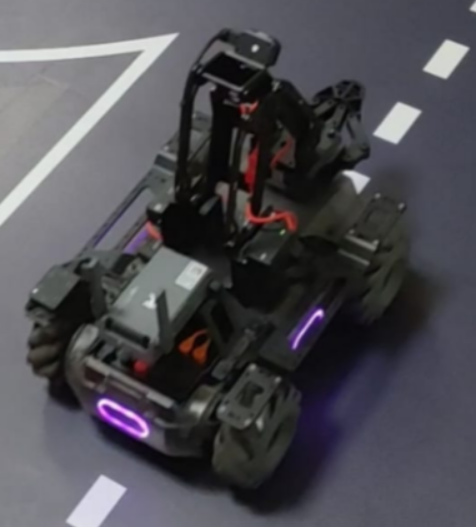
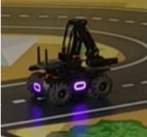

## MobileRobot-Openloopcontrol
## Aim:
To develop a python control code to move the mobilerobot along the predefined path.

## Equipments Required:
RoboMaster EP core
Python 3.7
## Procedure
## Step1:
Initiate the MobileRobot.

## Step2:
Connect your PC with the MobileRobot.

## Step3:
Open Python program.

## Step4:
Program the movements of the robot using python code.

## Step5:
Execute the python program.

## Program
```
'''
Python control code to move the mobilerobot along the predefined path.
Developed by: Dharani.E
Register No.: 212221230021
'''
from robomaster import robot
import time

if __name__ == '__main__':
    ep_robot = robot.Robot()
    ep_robot.initialize(conn_type="ap")

    ep_chassis = ep_robot.chassis

    ep_chassis.move(x=2, y=0, z=0, xy_speed=0.75).wait_for_completed()

    ep_chassis.move(x=0, y=0, z=90, xy_speed=1).wait_for_completed()

    ep_chassis.move(x=2, y=0, z=0, xy_speed=0.75).wait_for_completed()

    ep_robot.close()
```

## MobileRobot Movement Image:


## Start point:


## End point:



## MobileRobot Movement Video:

Upload your video in Youtube and paste your video-id here

[](https://www.youtube.com/watch?v=YOUTUBE_VIDEO_ID_HERE)

<br/>
<br/>
<br/>
<br/>

## Result:
Thus the python program code is developed to move the mobilerobot in the predefined path.


<br/>
<br/>

```
Mobile Robotics Laboratory
Department of Artificial Intelligence and Data Science/ Machine Learning
Saveetha Engineering College
```
